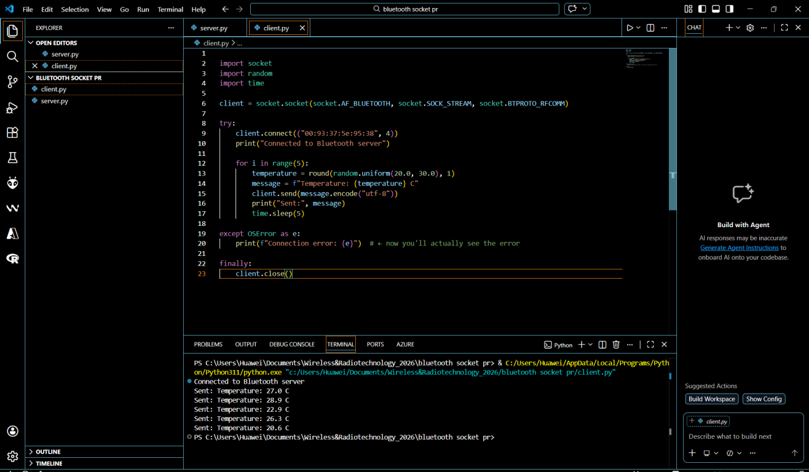
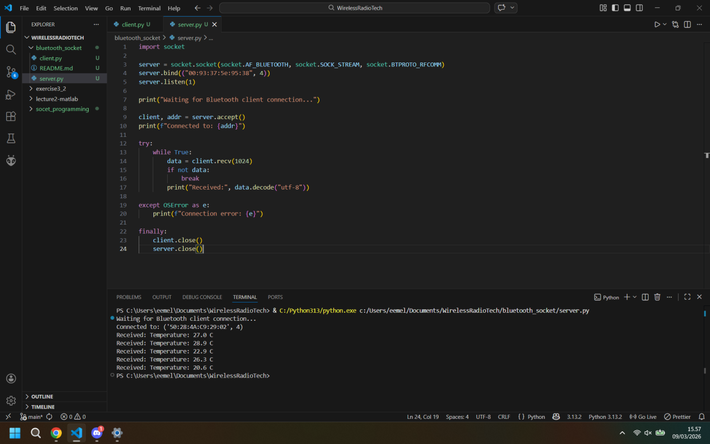

# Project description

This project implements a simple Bluetooth client–server application using Python and RFCOMM sockets. The system simulates an IoT sensor node sending temperature data to a gateway device over Bluetooth. The client acts as a sensor device that generates random temperature values. The server acts as a gateway that receives and prints the data. The client sends a new temperature value every 5 seconds through a Bluetooth connection.

# Bluetooth MAC Address Used

00:93:37:5e:95:38

# How to Run the Project
## 1. Pair the Devices

Before running the program:

Enable Bluetooth on both devices

Pair the devices through the operating system Bluetooth settings

## 2. Run the Server

On the gateway device, run:

python server.py

The server will wait for a Bluetooth connection.

## 3. Run the Client

On the sensor device, run:

python client.py

The client will connect to the server and start sending temperature values every 5 seconds.
Open a terminal in the project folder and run:

# Client side

# Server side

# Reflection
## What did I learn?

I learned how to create a Bluetooth client–server application using Python sockets.
This project helped me understand how RFCOMM communication works and how IoT devices can exchange data wirelessly.

## What was difficult?

1) Setting up Bluetooth communication

2) Finding and correctly using the Bluetooth MAC address

3) Making sure both devices were paired and able to connect

## Where could Bluetooth communication be useful in IoT?

Bluetooth communication is commonly used in IoT applications such as:

Smart home devices

Wearable health monitors

Wireless sensors

Smart locks

Fitness trackers

Device-to-device communication

Bluetooth is useful because it is low power, widely supported, and easy to integrate with small IoT devices.
